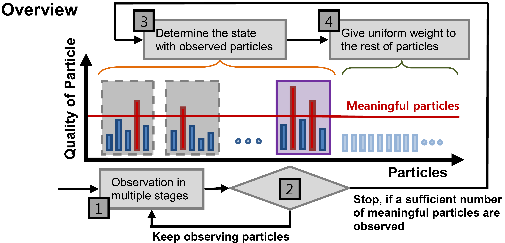

# Dynamic Resource Allocation by Ranking SVM for Particle Filter Tracking
Changkyu Song, Jeany Son, Suha Kwak, and Bohyung Han, Dynamic Resource Allocation by Ranking SVM for Particle Filter Tracking, in British Machine Vision Conference 2011 (BMVC 2011) [[PDF]](http://www.google.com/url?q=http%3A%2F%2Fwww.bmva.org%2Fbmvc%2F2011%2Fproceedings%2Fpaper103%2Fpaper103.pdf&sa=D&sntz=1&usg=AFQjCNGsFcjEOhpR8GkjA3vbUFuax_6Xkw) [[Poster]](https://drive.google.com/file/d/1JmALqgoEbf6tomW9PARWLTkXT1eyJ21y/view?usp=sharing) [[Project Page]](https://sites.google.com/site/changkyusong86/research/bmvc2011)

We propose a dynamic resource allocation algorithm based on Ranking Support Vector Machine (R-SVM) [1] for particle filter tracking. We adjust the number of observations in each frame adaptively and automatically, where tracker performs measurement for a subset of highly ranked particles in likelihood to preserve mode locations in the posterior and allocates the rest of particles to maintain the diversity of the posterior without actual measurements.

# Overview

# Results

# Author
[Changkyu Song](https://sites.google.com/site/changkyusong86) (changkyusong86@gmail.com)
